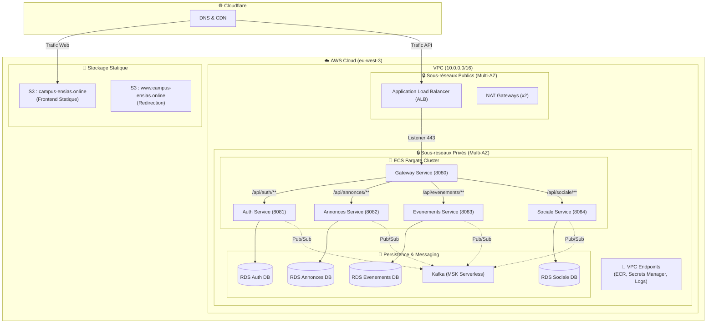

# 🎓 CampusFlow - Plateforme Collaborative Universitaire

CampusFlow est une application web sociale conçue pour dynamiser et simplifier la vie étudiante au sein d'un campus. Grâce à une architecture moderne basée sur des microservices, la plateforme favorise l'entraide et le partage communautaire.

---

## 🌟 Fonctionnalités du Projet
- **Petites Annonces** : Achat, vente ou don d'objets (calculatrices, livres, meubles).
- **Événements du Campus** : Planifiez, inscrivez-vous et suivez les activités du Bureau des Étudiants (BDE).
- **Flux d'Actualités** : Recevez des alertes et publications d'entraide en temps réel.
- **Messagerie instantanée** : Échanges interactifs directs entre utilisateurs.

---

## 👥 Rôles & Cas d'Utilisation

### 1. L'Étudiant (User)
*Cœur interactif de l'application.*
- **Authentification** : Création de compte et connexion sécurisée (JWT).
- **Annonces** : Publication, modification et suppression de ses propres biens et services ainsi + éactions par commentaires et likes.
- **Événements** : Inscription aux activités.
- **Communication** : Entrée en relation directe via messagerie WebSocket.

### 2. L'ADEI (Administrateur)
*Garant du bon fonctionnement et de l'animation du campus.*
- **Modération globale** : Suppression des contenus inappropriés.
- **Événements prioritaires** : Mise en avant des actualités institutionnelles et associatives.
- **Gestion des utilisateurs** : Bannissements ou restrictions de comptes signalés.

---


## 🛠️ Stack Technique

### Architecture Web & Frontend
- **React 18** avec **Vite** : Interface fluide, optimisée et réactive.
- **Tailwind CSS** : Design premium, responsive et accessible.

### Écosystème Backend (Spring Boot)
- **Java 17 / Spring Boot 3.x** : Orchestration de l'infrastructure.
- **Spring Cloud Gateway** : Passerelle unifiée d'accès aux services internes.
- **Spring Security & JWT** : Gestion rigoureuse des autorisations par jetons.
- **Apache Kafka** : Messagerie événementielle asynchrone performante.
- **WebSockets** : Connectivité push instantanée.

### Base de Données & Cloud DevOps
- **PostgreSQL 16** : Stockage relationnel multi-instances.
- **Amazon Web Services (AWS)** : Hébergement haute disponibilité via ECS Fargate.
- **Terraform (IaC)** : Automatisation et gestion des ressources serveurs.
- **Cloudflare** : Gestion DNS, routage CDN & sécurité HTTPS (certificats SSL).

## 🌐 Architecture des Microservices (Routes & Événements)

### 1. Gateway Service (Port 8080)
Point d'entrée unique de l'application gérant le routage et la sécurité CORS.

### 2. Auth Service (Port 8081)
- **Routes API** : `/api/auth/**` (Inscription, connexion, profils).
- **Kafka** : Publie les événements de mise à jour de profil sur le topic `user-profile-updates`.

### 3. Annonces Service (Port 8082)
- **Routes API** : `/api/annonces/**`, `/api/commentaires/**`.
- **Kafka** : Consomme le topic `user-profile-updates` pour synchroniser les informations d'utilisateurs.

### 4. Événements Service (Port 8083)
- **Routes API** : `/api/evenements/**`.
- **WebSockets** : `/api/evenements/notifications/stream`.
- **Kafka** : Consomme le topic `user-profile-updates`.

### 5. Sociale Service (Port 8084)
- **Routes API** : `/api/sociale/**`.
- **WebSockets** : `/api/sociale/ws` (Messagerie en temps réel).
- **Kafka** : Consomme le topic `user-profile-updates`.

---

## 📊 Schéma Topologique Dans AWS



## 🛡️ Description des composants

| Composant | Détails techniques |
| :--- | :--- |
| **VPC** | Découpé en 2 AZ avec 2 subnets publics (ALB) et 2 subnets privés (App & BDD). |
| **ECS Fargate** | Cluster hébergeant 5 microservices Java/Spring Boot indépendants. |
| **Bases RDS** | Instances PostgreSQL 16 (`db.t3.micro`) chiffrées KMS et configurées en Haute Disponibilité. |
| **MSK** | Broker de messagerie Kafka Serverless isolé dans le réseau privé. |
| **S3** | Stockage optimisé pour le contenu React/Vite frontend. |

---


## ⚙️ Installation & Démarrage (Local Docker)

### 1. Pré-requis Systèmes
Assurez-vous d'avoir installé :
- **Docker Desktop**
- **Java SDK 17**
- **Node.js** (V18+)

### 2. Démarrage Automatisé du Backend
Ouvrez votre terminal à la racine du projet et lancez les commandes suivantes :
```bash
# 1. Compiler les exécutables
mvn clean install -DskipTests

# 2. Lever les containers (BDD, Kafka et services)
docker-compose up --build
```

### 3. Lancement du Portail Utilisateur
```bash
cd frontend
npm install
npm run dev
```
---

## 🚀 Pipeline CI/CD & Déploiement Cloud

Le déploiement continu est piloté par **GitHub Actions** et **Terraform**.

### A. Configuration Cloud (AWS & Cloudflare)
1. **AWS** :
   - Créez un utilisateur IAM doté de permissions d'administration (`AdministratorAccess` pour Terraform).
   - Récupérez vos clés d'accès `AWS_ACCESS_KEY_ID` et `AWS_SECRET_ACCESS_KEY`.
2. **Cloudflare** :
   - Générez un Token API (`Zone.DNS` et `Zone.Settings`).

### B. Variables Terraform (`terraform/terraform.tfvars`)
Créez ce fichier localement (sécurisé et hors Git) pour stocker vos variables :
```hcl
jwt_secret           = "votre_jwt_secret"
auth_smtp_user       = "votre_email_smtp"
auth_smtp_pass       = "votre_mot_de_passe_smtp"
cloudflare_api_token = "votre_token_cloudflare"
```

### C. GitHub Actions (Déploiement Automatisé)
Le fichier `.github/workflows/deploy-aws.yml` déploie le frontend et les conteneurs Docker à chaque `push` sur la branche `main`.

**Configuration des Secrets GitHub :**
Rendez-vous dans les paramètres de votre dépôt : *Settings > Secrets and variables > Actions* et ajoutez :
- `AWS_ACCESS_KEY_ID` : Votre identifiant de clé AWS.
- `AWS_SECRET_ACCESS_KEY` : Votre clé secrète AWS.

---

## 🚀 Infrastructure & DevOps Local (Kubernetes) :

Le projet utilise une architecture de pointe basée sur le **GitOps** pour garantir un déploiement automatisé, résilient et scalable.

### 🏗️ Architecture du Cluster
- **Orchestrateur** : K3s (Kubernetes léger).
- **GitOps Engine** : Argo CD (Synchronisation automatique avec GitHub).
- **Ingress Controller** : Traefik (Routage via `campusflow.local`).
- **Autoscaling** : HPA (Horizontal Pod Autoscaler) basé sur le CPU.

### 💻 Déploiement sur Serveur Local

#### 1. Configuration des Pré-requis (Obligatoire)

Avant de lancer l'infrastructure, vous devez configurer deux types de secrets :

**A. Secrets Locaux (pour le cluster K3s) :**
Créez un fichier `secrets.yaml` à la racine du projet (ce fichier est ignoré par Git) :
```yaml
apiVersion: v1
kind: Secret
metadata:
  name: campusflow-secrets
  namespace: default
stringData:
  AUTH_DB_PASSWORD: "votre_mot_de_passe"
  JWT_SECRET: "votre_cle_jwt"
  AUTH_SMTP_USER: "votre_email"
  AUTH_SMTP_PASS: "votre_password_smtp"
  CLOUDFLARE_TUNNEL_TOKEN: "votre_token_cloudflare" # Token généré sur le dashboard Cloudflare Zero Trust (Si vous n'utilisez pas Cloudflare, vous pouvez laisser ce champ vide)
```
*Ansible utilisera ce fichier pour générer automatiquement le **SealedSecret**.*

**B. Secrets GitHub (pour la CI/CD) :**
Dans votre repo GitHub (*Settings > Secrets > Actions*), ajoutez les secrets suivants :
- `DOCKER_USERNAME` : Votre login Docker Hub.
- `DOCKER_PASSWORD` : Votre mot de passe Docker Hub.

**C. Configuration du Dépôt Git (pour ArgoCD) :**
Modifiez le fichier `argocd/argocd-app.yml` pour y renseigner l'URL de **votre propre dépôt** GitHub afin qu'ArgoCD puisse synchroniser les manifests :
```yaml
repoURL: https://github.com/votre-username/CampusFlow.git
```

**D. Configuration des Valeurs (values.yaml) :**
Enfin, modifiez le fichier `helm/campusflow/values.yaml` pour y renseigner votre nom d'utilisateur Docker Hub afin que le cluster télécharge vos images :
```yaml
dockerUsername: "votre-username-docker-hub"
```

#### 2. Intégration Continue (CI)

Chaque `git push` déclenche un workflow **GitHub Actions** qui :
- Compile les microservices (Java/Maven).
- Build les images Docker.
- Les pousse sur **Docker Hub**.

#### 4. Déploiement Continu (CD via GitOps)
Le cluster surveille le dossier `helm/` :
- **Détection** : Argo CD voit les changements sur GitHub.
- **Synchronisation** : Il "tire" (Pull) les nouveaux manifests et met à jour les pods.
- **Auto-cicatrisation** : Si un pod tombe ou est modifié manuellement, Argo CD le réinitialise selon la configuration Git.


### 📈 Autoscaling & Élasticité
L'application est configurée pour s'adapter à la charge :
- **Auth & Gateway** : Scalent automatiquement de 2 à 5 instances si le CPU dépasse 70-80%.
- **Frontend** : Scale jusqu'à 6 instances pour garantir la fluidité de l'interface.
- **Surveillance** : Suivez l'état en temps réel avec `kubectl get hpa`.

### 🌐 Accès & Routage (Ingress)

Le cluster utilise **Traefik Ingress Controller** comme point d'entrée unique (Reverse Proxy).

- **Options d'Exposition** :
  - **Option 1 : Locale (par défaut)** : Utilisez `campusflow.local` (nécessite de modifier `/etc/hosts`).
  - **Option 2 : Cloudflare Tunnel** : Utilisez votre domaine public (ex: `ensiasy.online`) sans ouvrir de ports.

- **Domaines (selon votre choix)** :
  - Application : `https://ensiasy.online` ou `http://campusflow.local`
  - ArgoCD : `https://argocd.ensiasy.online` ou `http://argocd.campusflow.local`
  - Grafana : `https://grafana.ensiasy.online` ou `http://grafana.campusflow.local`
  - Prometheus : `https://prometheus.ensiasy.online` ou `http://prometheus.campusflow.local`

- **Règles de routage** :
    - `/` (Racine) : Redirige vers le service **Frontend** (React).
    - `/api` : Redirige vers la **Gateway** qui orchestre ensuite les appels vers les microservices.


- **Activation de Cloudflare (Étapes Manuelles)** :
  Dans 'helm/campusflow/values.yaml', passez 'cloudflare.enabled' à 'true' et renseignez le 'CLOUDFLARE_TUNNEL_TOKEN' dans votre 'secrets.yaml'.

  1. **Création du Tunnel** : Dans le Dashboard Cloudflare Zero Trust > Networks > Tunnels, créez un tunnel nommé `campusflow`.
  2. **Configuration du Routage** : Dans l'onglet **Public Hostname**, ajoutez deux entrées :
     - `ensiasy.online` -> `http://traefik.kube-system.svc.cluster.local:80`
     - `*.ensiasy.online` -> `http://traefik.kube-system.svc.cluster.local:80`
  3. **Récupération du Token** : Copiez le token du connecteur (Docker) commençant par `eyJh...`.
  4. **Secrets** : Ajoutez ce token dans votre fichier `secrets.yaml` local sous la clé `CLOUDFLARE_TUNNEL_TOKEN`.

- **Configuration locale (/etc/hosts)** :
  Si vous n'utilisez pas Cloudflare, ajoutez ces lignes à votre fichier /etc/hosts (Linux/Mac) ou C:\Windows\System32\drivers\etc\hosts (Windows) : 
  ```text
  127.0.0.1 campusflow.local
  127.0.0.1 argocd.campusflow.local
  127.0.0.1 grafana.campusflow.local
  127.0.0.1 prometheus.campusflow.local
  ```
  > Pour Vagrant, remplacez 127.0.0.1 par l'IP de votre VM (ex: 192.168.x.x).

### Installation du Serveur Local
Une fois les Pré-requis configurés, lancez l'installation :

**Sur Linux** :
```bash
ansible-playbook -i ansible/inventory.ini ansible/playbook.yml -K
```

**Sur Windows** :
Assurez-vous d'avoir installé Vagrant et VirtualBox sur votre machine. Utilisez ensuite cette commande :
```bash
vagrant up
```

### 📊 Monitoring & Observabilité


Le projet intègre une stack de surveillance complète pour suivre la santé des microservices en temps réel.

- **Prometheus** : Collecte les métriques exposées par chaque microservice via les endpoints Spring Boot Actuator (`/actuator/prometheus`).
- **Grafana** : Visualise les données sous forme de tableaux de bord interactifs.
  - **Dashboard pré-configuré** : Un tableau de bord spécialisé pour Spring Boot est importé automatiquement au démarrage.
  - **Statistiques disponibles** : Utilisation CPU, Mémoire JVM, Temps de réponse des APIs, Taux d'erreurs, État des connexions Kafka.

**Accès aux interfaces :**
- **Grafana** : `https://grafana.ensiasy.online` (Login: `admin` / `admin`)
- **Prometheus** : `https://prometheus.ensiasy.online`
- **ArgoCD** : `https://argocd.ensiasy.online`

---

## 🛡️ Gestion des Secrets (Maintenance)

Si vous avez besoin de voir les valeurs réelles utilisées par le cluster :
```bash
kubectl get secret campusflow-secrets -o json | jq '.data | map_values(@base64d)'
```